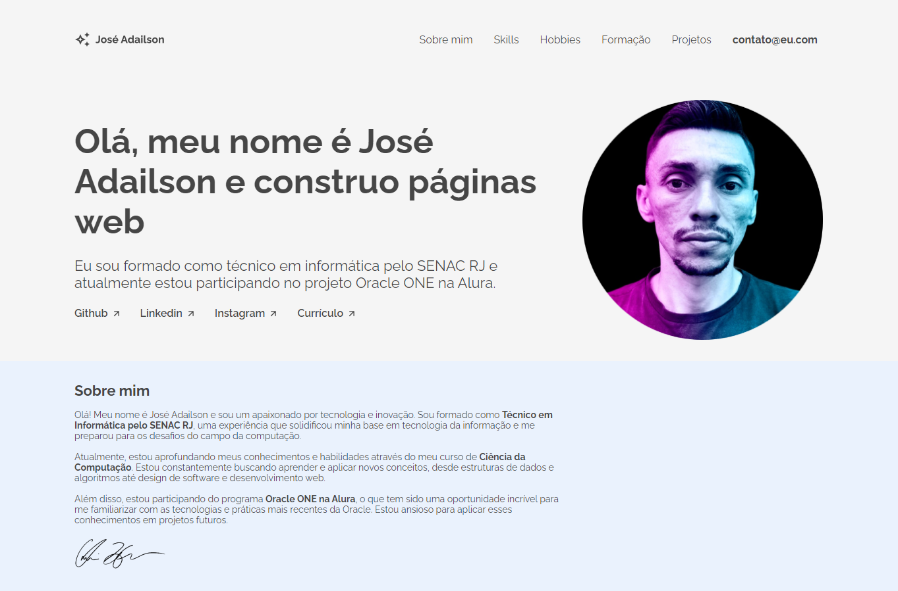

# Challenge ONE Front End - Portfólio

O objetivo principal deste desafio era viver a experiência de realizar um projeto real, tal como ocorre no dia a dia de um desenvolvedor. Nele tive a oportunidade de praticar os conceitos aprendidos nos cursos realizados até agora. Este desafio me ajudou a consolidar e fortalecer os conhecimentos em estilização, responsividade, HTML e fundamentais para o design e desenvolvimento web.

## Screenshots

## Stack utilizada

## Licença

## Referência

- [Figma do Desafio](<https://www.figma.com/design/D6nbYJdG7yxwTB1COh0Iki/Challenge-Front-end-Portf%C3%B3lio-(Copy)>)
